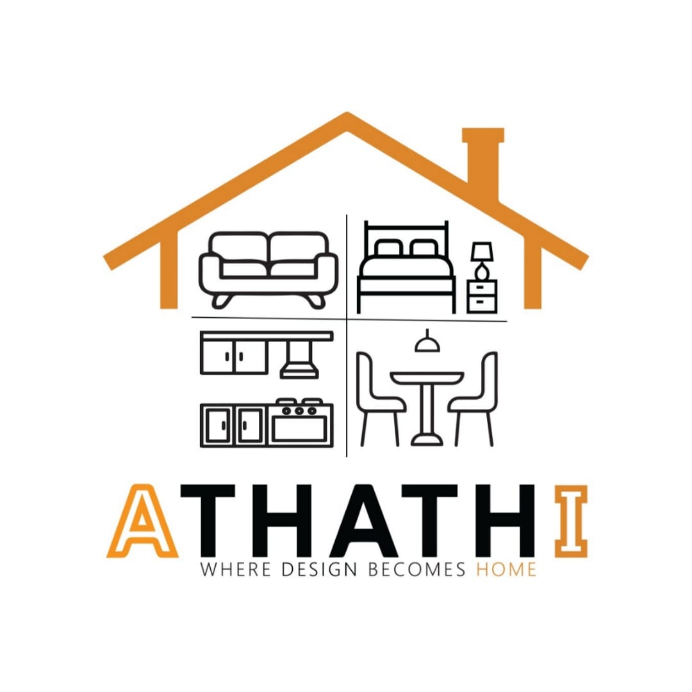

# ATHATHI – AI-Powered Furniture #

  

---

## 📌 Overview ##

ATHATHI is a smart platform that transforms how people design and furnish spaces.  
We combine AI-powered tools, real manufacturing insight, and curated design workflows to help users make confident, high-quality decisions.

---

## 🚨 Problem Statement ##

Furnishing a space today is:

- Complex and time-consuming  
- Lacks transparency in materials and pricing  
- Difficult to visualize before execution  
- Prone to costly mistakes  

---

## 💡Solution ##

ATHATHI simplifies the entire journey by providing:

- Intelligent design assistance  
- Personalized furniture recommendations  
- Visualization before purchase  
- End-to-end experience from idea to execution  

---

## ✨Core Features ##

- AI-assisted room design  
- Smart furniture recommendations  
- Basic customization (materials, colors, layout)  
- Seamless shopping and checkout experience  
- Order tracking and progress visibility  

---

## 💫Vision ##

To become the go-to platform for designing and furnishing spaces with confidence, combining technology, design, and real-world execution.

---

## 🚧Status ##

Currently in MVP development phase

---

## ✊Team ##

Built by a multidisciplinary team combining:
- Software Engineering  
- AI & Data  
- UI/UX Design  
- Business Development  

---

## 📩Contact ##

For collaboration or inquiries:  
[https://github.com/Abdelrahman-Mano] | [https://www.linkedin.com/in/abdelrahmanayman1]
